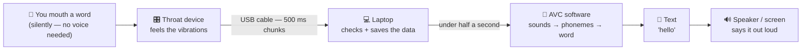
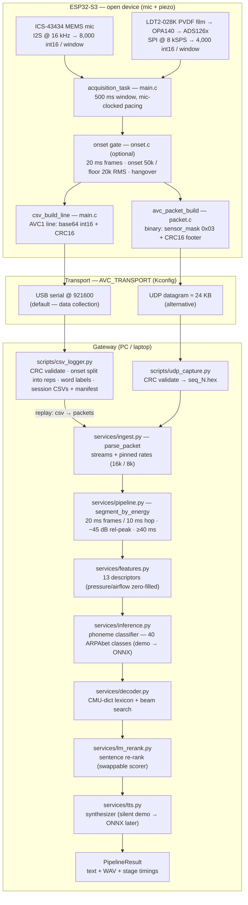

# AVC — Artificial Vocal Card

Silent-speech-to-speech pipeline: you mouth a word without voicing it, a
small throat device feels the vibrations, and a Python pipeline turns
them into phonemes → words → synthesized speech.

**Hardware track (this branch):** the **open device** — two sensors,
mic + piezo. The `master` branch keeps the 4-sensor closed-device
reference; the wire format and model contract are identical for both.

## How it works — user's view 🙂



One sentence: **you mouth → device feels → laptop thinks → speaker speaks.**
The piezo film on the throat carries most of the signal (~60–70%
importance); the mic catches residual sound shape.

## How it works — technical data flow ⚙️



Latency budget: **< 500 ms end-to-end** (TRD 5.x) — ingest <5 ·
features <10 · inference <50 · decode <100 · LM <100 · TTS the rest.
Measured with demo backends: ~8–14 ms plumbing.

Full annotated versions with step tables, locked contracts, and
data-size notes: [`docs/DATA_FLOW_DIAGRAMS.md`](docs/DATA_FLOW_DIAGRAMS.md).

**Status:** runnable end-to-end software reference (86 tests green) +
firmware skeleton with lockstep-tested packet format, synthetic-sensor
mode, USB-serial CSV transport, and the data-collection logger. Open-device
migration **M2.1 + M2.4 done**; sensor drivers (M2.2/M2.3) await the
physical board. See [`IMPLEMENTATION_PLAN.md`](IMPLEMENTATION_PLAN.md)
and [`docs/PLAN_2_SENSOR_OPEN_DEVICE.md`](docs/PLAN_2_SENSOR_OPEN_DEVICE.md)
for the roadmap to the >85% / <500 ms TRD targets.

## Quickstart (software only)

Python 3.11+, numpy — nothing else required:

```bash
python -m unittest discover -s tests        # 86 tests
```

Run the pipeline on a capture file (one hex packet per line; the default
`capture/demo.hex` is an **open-device 2-sensor capture**, mic + piezo):

```bash
python -m services.pipeline capture/demo.hex --backend demo --tts silent --report
```

With a trained model (later milestones), `--backend onnx` and
`--tts onnx` pick up `models/avc_phoneme.onnx` / `models/tts.onnx`
without any code changes (see `models/README.md`).

## Live capture from the board

**Data-collection phase (default transport `usb_serial`):**

```bash
python scripts/csv_logger.py --port COM5 --baud 921600 --speaker sai --prompt --out data
```

The logger validates every line (CRC16), splits windows into labeled
repetitions (gateway-side onset gate, SATHVANI §5 semantics), writes
`data/session_*/rep_*_<word>.csv` + `manifest.json`, and replays any
rep through the pipeline:

```bash
python scripts/csv_logger.py --replay data/session_*/rep_000_hello.csv
```

No hardware? `--self-test` runs the whole logger path on synthetic
windows (generate → validate → split → write → replay → pipeline).

**Binary packets (transport `udp`):**

```bash
python scripts/udp_capture.py --port 7777 --out capture
```

Each validated packet lands in `capture/seq_<n>.hex`, directly
replayable through the pipeline command above.

## Firmware

See [`firmware/README.md`](firmware/README.md) — ESP-IDF v5.x build,
wire-format spec (binary packets + CSV lines), Kconfig transport/sensor
set, and the host-runnable lockstep test (`firmware/test/test_packet.c`).
Until sensor pinouts are locked, the default build streams deterministic
synthetic data so the whole firmware→transport→Python path can be
exercised with only a board.

## Layout

| Path | Contents |
|---|---|
| `services/` | Pipeline layers 2–4 (ingest, features, inference, decoder, LM, TTS, orchestrator + CLI) |
| `tests/` | Unittest suite — stdlib + numpy only |
| `firmware/` | ESP32-S3 firmware (packet serializer, acquisition + UDP, host lockstep test) |
| `scripts/` | Gateway-side utilities (`csv_logger.py`, `udp_capture.py`) |
| `models/` | Model file conventions (tracked; weights are not) |
| `docs/` | Plans + [`DATA_FLOW_DIAGRAMS.md`](docs/DATA_FLOW_DIAGRAMS.md) (user + technical flow diagrams) |
| `AVC_TRD_*.txt` | Original requirements document (spec source) |

## Design rules

- **Zero-install core:** stdlib + numpy run everything; onnxruntime,
  torch are lazy/optional imports that fail over to demo backends.
- **One source of truth:** descriptor list, phoneme vocab (40 classes),
  and phoneme classes live in `services/schemas.py` only.
- **Python ↔ C lockstep:** the wire format is pinned and enforced both
  ways by golden-vector tests (`tests/test_ingest.py`,
  `firmware/test/test_packet.c`).
- **Swappable stages:** classifier, LM scorer, and TTS are factory-
  selected; the demo backends exist to test plumbing, never for
  accuracy claims.

## Open questions

1. ESP32-S3 board + pinout (mic + piezo drivers, M2.2/M2.3)
2. Dataset: reuse the 48-instance research set or collect new sessions
3. Protocol of the existing physical device (TRD vs. this format)

License: **Apache-2.0** (resolved) — see [`LICENSE`](LICENSE).
