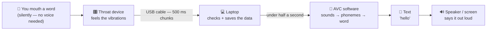
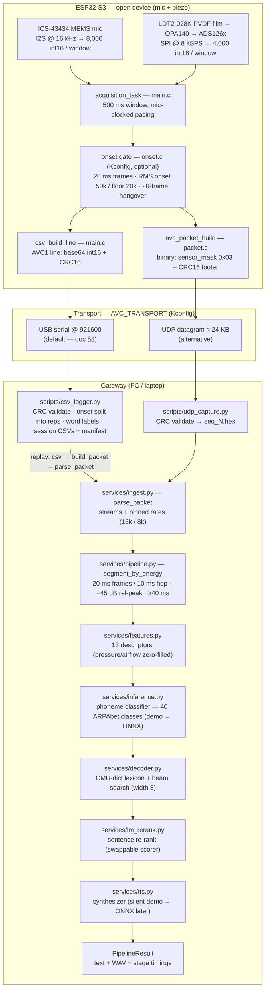

# AVC Data Flow — Diagrams

Two views of the same pipeline: the **user's view** (what it feels like)
and the **engineer's view** (what actually happens). Current hardware
track: the **open device** — mic + piezo only
(branch `feature/2-sensor-open-device`; `master` keeps the 4-sensor
closed-device reference).

---

## 1. Normal view — user's perspective

**Step by step — what you experience vs. what is actually happening:**

| # | What you experience 🙂 | What is actually happening ⚙️ |
|---|---|---|
| 1 | You mouth a word — no sound needed | Mic + throat sensor record a **500 ms window** of vibrations (8,000 mic + 4,000 piezo samples) |
| 2 | A small device sits on your throat | The board checks the window is **speech, not silence** (onset gate) and stamps it with an error-check code (CRC) |
| 3 | Data streams down the cable to the laptop | One CRC-checked **CSV line per window** over USB serial (base64-encoded samples) |
| 4 | The laptop "thinks" for a moment | Software measures **13 signal descriptors** → classifies **phonemes** (sound units) → dictionary + beam search build the most likely **words** |
| 5 | The speaker says "hello" | The best sentence is re-ranked by a language model and **synthesized to audio** — target under **0.5 s** end to end |

**One-liner:** you mouth → device feels → laptop thinks → speaker speaks.

**Why two sensors?** The piezo film (on the throat) feels the *muscle and
air* movement — it carries most of the signal (~60–70% importance). The
tiny mic catches *residual sound shape*. Pressure/airflow sensors exist
only on the closed-device variant; on the open device their features are
zero-filled so the model contract stays identical.

---

## 2. Technical view — engineer's perspective

**Stage latency budget (TRD 5.x — end-to-end target < 500 ms):**

| Stage | Budget | Module | Notes |
|---|---|---|---|
| Ingest / parse | < 5 ms | `services/ingest.py` | CRC16 + struct unpack |
| Features | < 10 ms | `services/features.py` | 13 descriptors, dialogue-normalized |
| Inference | < 50 ms | `services/inference.py` | ONNX runtime once trained (M3) |
| Decode | < 100 ms | `services/decoder.py` | lexicon + beam search |
| LM re-rank | < 100 ms | `services/lm_rerank.py` | swappable scorer |
| TTS | remainder | `services/tts.py` | will dominate the budget (M5) |
| **Measured (demo backends)** | **~8–14 ms** | whole pipeline | plumbing only — no accuracy claims |

**Locked contracts (do not change one side without the other):**

| Contract | Defined in | Value |
|---|---|---|
| Binary wire format | `ingest.py` ↔ `packet.c` | `<IIB` header · per-sensor `<H` + int16 LE · CRC16-CCITT footer |
| CSV line format | `csv_logger.py` ↔ `main.c` | `AVC1,<seq>,<ts>,<mask>,<onset>,<label>,<b64…>,<crc16>` |
| Sample rates | `ingest.py` ↔ `packet.h` | mic 16 kHz · piezo 8 kHz (ADS126x) · pressure/airflow 100 Hz |
| 13 descriptors | `schemas.py` `DESCRIPTOR_NAMES` | order is part of the (B, T, 13) model input |
| Phoneme vocab | `schemas.py` `PHONEME_VOCAB` | 40 classes (39 ARPAbet incl. HH + SIL) |
| Onset thresholds | `onset.c` ↔ `onset.py` | 50k / 20k / 20-frame hangover (raw-count scale) + provisional int16 3000/1200 |

**Data sizes:** one open-device window = 8,000 + 4,000 int16 = 24,000
samples ≈ 24.4 KB binary (or ~32.5 KB as a base64 CSV line) — fits one
UDP datagram and the 921600-baud serial line with headroom.
